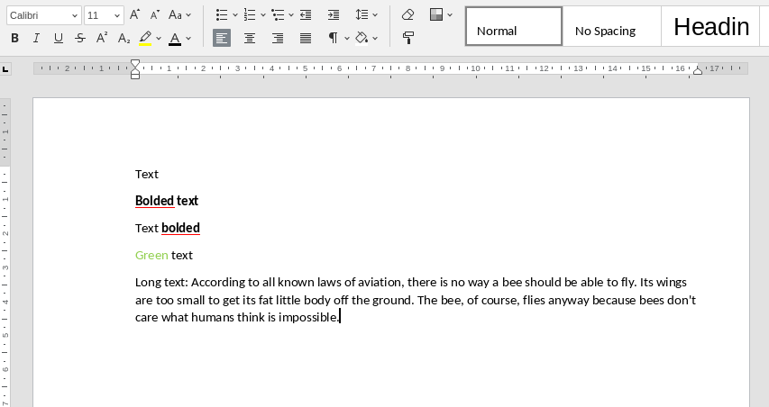
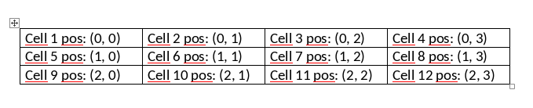
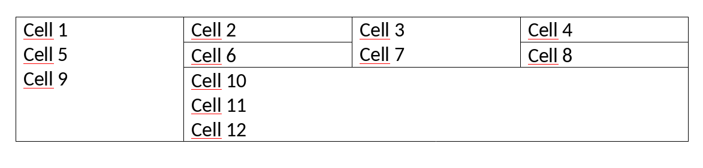
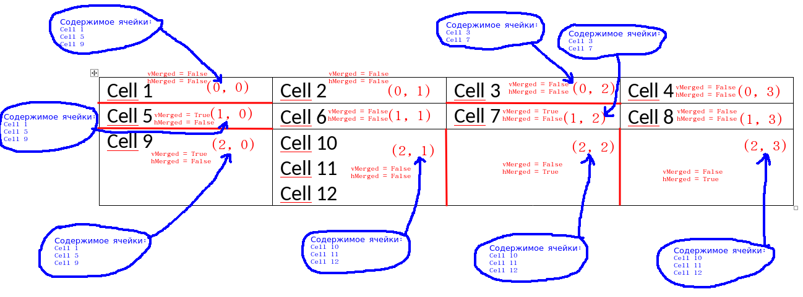

# docxparsek

`docxparsek` - это простейший парсер docx-файлов для python3. 

# Зависимости

Для работы нужно установить пакеты `bs4` и `lxml`:

``` bash
> pip3 install bs4
> pip3 install lxml
```

# Классы и методы

Краткий список доступных методов. [Подробнее в следующем пункте ниже](#использование).

1. `Doc` - документ. Содержит `Line`.

- - `getDocXML` - получить xml самого документа;

- - `readFileText` - прочитать любой файл в docx, как текстовый;

- - `getImageBytes` - получить байты рисунка;

- - `readImage` - прочитать определённый рисунок в docx;

- - `getLines` - получить все `Line`.

2. `Line` - абстракция. Может быть либо `Text`, либо `Image`, либо `Table`. Все `Line` идут друг за другом также как и в docx-документе.

- - `getType` - получить тип объекта;

- - `isText` - **True**, если данный `Line` - это `Text`;

- - `isImage` - **True**, если данный `Line` - это `Image`;

- - `isTable` - **True**, если данный `Line` - это `Table`;

- - `isOther` - **True**, если данный `Line` - это `Other`;

- - `getSrc` - получить сам объект, который либо `Text`, либо `Image`, либо `Table`.

3. `Text` - текст. Содержит `Run`.

- - `getText` - получить сами символы текста;

- - `isBold` - **True**, если текст жирный;

- - `isItalic` - **True**, если текст курсивный;

- - `isUnderline` - **True**, если текст подчёркнутый;

- - `isColored` - **True**, если текст нестандартного цвета;

- - `getColor` - получить цвет текста в hex формате;

- - `getRuns` - получить все `Run`.

4. `Run` - элемент текста.

- - `getText` - получить сами символы текста;

- - `isBold` - **True**, если текст жирный;

- - `isItalic` - **True**, если текст курсивный;

- - `isUnderline` - **True**, если текст подчёркнутый;

- - `isColored` - **True**, если текст нестандартного цвета;

- - `getColor` - получить цвет текста в hex формате.

5. `Image` - содержит байты рисунка.

- - `getBytes` - получить байты рисунка.

6. `Table` - таблица. Содержит `Row`.

- - `getCell` - получить определённую ячейку таблицы.

7. `Row` - строка таблицы. Содержит `Cell`.

- - `getRowNum` - получить номер данной строки таблицы;

- - `getCell` - получить ячейку в строке по номеру.

8. `Cell` - ячейка таблицы. Содержит `Line`.

- - `getPosition` - получить номер строки и номер столбца ячейки;

- - `getLines` - получить все `Line`;

- - `isMerged` - **True**, если ячейка часть другой ячейки;

- - `is_vMerged` - **True**, если данная ячейка объединена с ячейкой выше;

- - `is_hMerged` - **True**, если данная ячейка объединена с ячейкой слева.

# Использование

Распакуйте [релиз](https://github.com/The220th/docxparsek/releases) и используйте его как пакет (package).

## `Doc` и `Line`

Нужно открыть docx-файл с помощью класса `Doc`, который содержит набор `Line`. Каждый `Line` - это абстракция, которая представляет из себя либо `Text`, либо `Image`, либо `Table`.

``` python
# -*- coding: utf-8 -*-

from docxparsek import Doc
from docxparsek import Line


if __name__ == "__main__":

    doc = Doc("/path/to/docx/file")

    for line in doc:
        if(line.isText()):
            text = line.getSrc()
            # Работа с текстом
        elif(line.isImage()):
            image = line.getSrc()
            # Работа с рисунком
        elif(line.isTable()):
            table = line.getSrc()
            # Работа с таблицей
        elif(line.isOther()):
            # Не текст, не рисунок, не таблица
```

## `Text` и `Run`

`Text` - это текст в абзаце, который имеет некоторые флаги, такие как: `bold`, `italic`, `color` и `underline`. Также `Text` содержит в себе `Run`ы. Причём от сохранения к сохранению docx-файла кол-во `Run`ов может отличаться. 

`Run` - такой класс, который содержит в себе части текста. Нужна эта штука, если часть текста может быть, например, жирной и зеленой, а часть курсивом и подчёркнутой:

**Text***line*

`Line` выше, представляет собой `Text`, с содержимым "Textline". Сам этот `Text` будет жирным и курсивным (потому что хотя бы 1 символ жирный и курсивный). Также этот `Text` содержит, скорее всего, 3 `Run`:

1. `Run` 1: содержимое "Text", жирный

1. `Run` 2: содержимое "line", курсив

1. `Run` 3: пустой. Метод `getText()` вернёт `None`

Например, пусть docx-файл будет выглядеть так:



Тогда класс `Doc` будет содержать 5 штук `Line`:

1. `Text` обычный. Метод `getText()` вернёт "Text". Содержит, вероятно, 2 `Run`.

- - `Run` 1: Метод `getText()` вернёт "Text". Обычный.

- - `Run` 2: пустой. Метод `getText()` вернёт `None`

2. `Text` жирный (bold). Метод `getText()` вернёт "Bolded text". Содержит, вероятно, 2 `Run`

- - `Run` 1: Метод `getText()` вернёт "Bolded text". Жирный.

- - `Run` 2: пустой. Метод `getText()` вернёт `None`

3. `Text` жирный (bold). Метод `getText()` вернёт "Text bolded". Содержит, вероятно, 3 `Run`

- - `Run` 1: Метод `getText()` вернёт "Text ". Обычный.

- - `Run` 2: Метод `getText()` вернёт "bolded". Жирный.

- - `Run` 3: пустой. Метод `getText()` вернёт `None`

4. `Text` зелёный. Метод `getText()` вернёт "Green text". Содержит, вероятно, 3 `Run`

- - `Run` 1: Метод `getText()` вернёт "Green". Зелёный.

- - `Run` 2: Метод `getText()` вернёт " text". Обычный.

- - `Run` 3: пустой. Метод `getText()` вернёт `None`

5. `Text` Обычный. Модержит неопределённое кол-во `Run`ов. Их может быть как 2, так и штук 10. По какому принципу word определяет их количество пока что не известно. Но можно точно сказать, что все эти `Run`ы будут обычные и по частям содержать текст абзаца.

Пример возможного скрипта для `Text`:

``` python
# -*- coding: utf-8 -*-

from docxparsek import Doc
from docxparsek import Line
from docxparsek import Text
from docxparsek import Run

def getTextProp(text : 'Text') -> str:
    res = ""
    if(text.isBold()):
        res += "BOLD, "
    if(text.isItalic()):
        res += "ITALIC, "
    if(text.isUnderline()):
        res += "UNDERLINE, "
    if(text.isColored()):
        res += "COLORED="
        res += text.getColor()
    else:
        res += "STD COLOR"
    return res

def getRunProp(run : 'Run') -> str:
    res = ""
    if(run.isBold()):
        res += "BOLD, "
    if(run.isItalic()):
        res += "ITALIC, "
    if(run.isUnderline()):
        res += "UNDERLINE, "
    if(run.isColored()):
        res += "COLORED="
        res += run.getColor()
    else:
        res += "STD COLOR"
    return res


if __name__ == "__main__":
    doc = Doc("./file.docx")

    line_i = 0
    for line in doc:
        if(line.isText()):
            print(f"{line_i}:<TEXT>")
            text = line.getSrc()
            print(f"\t\"{text.getText()}\" - {getTextProp(text)}")
            print(f"\t<RUNS>")
            run_i = 0
            for run in text:
                print(f"\t\tRUN_{run_i}: \"{run.getText()}\" - {getRunProp(run)}")
                run_i+=1
        else:
            pass # Другого быть и не может в данном документе
        line_i+=1
```

Вывод данного скрипта для случая выше:

``` bash
0:<TEXT>
        "Text" - STD COLOR
        <RUNS>
                RUN_0: "Text" - STD COLOR
                RUN_1: "None" - STD COLOR
1:<TEXT>
        "Bolded text" - BOLD, STD COLOR
        <RUNS>
                RUN_0: "Bolded text" - BOLD, STD COLOR
                RUN_1: "None" - STD COLOR
2:<TEXT>
        "Text bolded" - BOLD, STD COLOR
        <RUNS>
                RUN_0: "Text " - STD COLOR
                RUN_1: "bolded" - BOLD, STD COLOR
                RUN_2: "None" - STD COLOR
3:<TEXT>
        "Green text" - COLORED=92D050
        <RUNS>
                RUN_0: "Green " - COLORED=92D050
                RUN_1: "text" - STD COLOR
                RUN_2: "None" - STD COLOR
                RUN_3: "None" - STD COLOR
                RUN_4: "None" - STD COLOR
4:<TEXT>
        "Long text: According to all known laws of aviation, there is no way a bee should be able to fly. Its wings are too small to get its fat little body off the ground. The bee, of course, flies anyway because bees don&apos;t care what humans think is impossible." - STD COLOR
        <RUNS>
                RUN_0: "Long text: " - STD COLOR
                RUN_1: "According to all known laws of aviation, there is no way a bee should be able to fly. Its wings are too small to get its fat little body off the ground. The bee, of course, flies anyway because bees don't care what humans think is impossible." - STD COLOR
                RUN_2: "None" - STD COLOR

```

Метод `getColor()` возвращает цвет в hex формате. Посмотреть этот цвет можно, например, [тут](https://colorscheme.ru/color-converter.html).

## `Image`

`Image` - это рисунок/картинка. Эту картинку можно сохранить как `png-файл`.

Например:

``` python
# -*- coding: utf-8 -*-

from docxparsek import Doc
from docxparsek import Line
from docxparsek import Image

doc = Doc("/path/to/docx/file")

image_i = 0
for line in doc:
    if(line.isText()):
        # ...
    elif(line.isImage()):
        image = line.getSrc()
        with open(f"image{image_i}.png", 'wb') as temp:
            temp.write(image.getBytes())
        image_i+=1
        # Работа с рисунком
    elif(line.isTable()):
        table = line.getSrc()
        # ...
    elif(line.isOther()):
        # ...

```

## `Table`, `Row` и `Cell`

`Table` - это набор `Row`.

`Row` - это набор `Cell`.

`Cell` - это набор `Line`. Также как и в `Doc`. То есть в каждом `Cell` содержится `Line`, которая представляет из себя либо `Text`, либо `Image`, либо `Table`.

В простейшем случае таблица может выглять так:



Здесь всего 12 ячеек, позицию каждой ячейки можно получить с помощью метода `getPosition()`, который вернёт кортеж.

Интересности начинаются при объединении ячеек.

У ячеек есть 2 флага:

- `vMerged`. Выставляется в `True`, если является копией ячейки сверху. Это происходит при вертикальном объединении.

- `hMerger`. Выставляется в `True`, если является копией ячейки слева. Это происходит при горизонтальном объединении.

Пример:



Тоже 12 ячеек. Ниже показано, как это выглядит в классе `Table`.



Как видно, следующие группы ячеек одиннаковые:

- (0, 0), (1, 0), (2, 0)

- (0, 2), (1, 2)

- (2, 1), (2, 2), (2, 3)

Одиннаковые только `Line` внутри, но координаты и флаги разные.

Скрипт для обработки таблицы:

``` python
# -*- coding: utf-8 -*-

from docxparsek import Doc
from docxparsek import Line
from docxparsek import Text
from docxparsek import Table
from docxparsek import Row
from docxparsek import Cell

if __name__ == "__main__":
    doc = Doc("./test.docx")

    for line in doc:
        if(line.isText()):
            pass
            #...
        elif(line.isImage()):
            pass
            #...
        elif(line.isTable()):
            print("<TABLE>")
            table = line.getSrc()
            for row in table:
                for cell in row:
                    print(f"\t<CELL {cell.getPosition()}> - vMerged={cell.is_vMerged()}, hMerged={cell.is_hMerged()}")
                    for cell_line in cell:
                        text = cell_line.getSrc()
                        print(f"\t\t{text.getText()}")

```

Вывод данного скрипта для случая выше:

``` bash
<TABLE>
        <CELL (0, 0)> - vMerged=False, hMerged=False
                Cell 1
                Cell 5
                Cell 9
        <CELL (0, 1)> - vMerged=False, hMerged=False
                Cell 2
        <CELL (0, 2)> - vMerged=False, hMerged=False
                Cell 3
                Cell 7
        <CELL (0, 3)> - vMerged=False, hMerged=False
                Cell 4
        <CELL (1, 0)> - vMerged=True, hMerged=False
                Cell 1
                Cell 5
                Cell 9
        <CELL (1, 1)> - vMerged=False, hMerged=False
                Cell 6
        <CELL (1, 2)> - vMerged=True, hMerged=False
                Cell 3
                Cell 7
        <CELL (1, 3)> - vMerged=False, hMerged=False
                Cell 8
        <CELL (2, 0)> - vMerged=True, hMerged=False
                Cell 1
                Cell 5
                Cell 9
        <CELL (2, 1)> - vMerged=False, hMerged=False
                Cell 10
                Cell 11
                Cell 12
        <CELL (2, 2)> - vMerged=False, hMerged=True
                Cell 10
                Cell 11
                Cell 12
        <CELL (2, 3)> - vMerged=False, hMerged=True
                Cell 10
                Cell 11
                Cell 12
```

# Пример

Вот скрипт, который может парсить docx-документ. Например [этот](./check.docx).

``` python
# -*- coding: utf-8 -*-

from docxparsek import Doc
from docxparsek import Line
from docxparsek import Text
from docxparsek import Run
from docxparsek import Image
from docxparsek import Table

def getTextProp(text : 'Text') -> str:
    res = ""
    if(text.isBold()):
        res += "BOLD, "
    if(text.isItalic()):
        res += "ITALIC, "
    if(text.isUnderline()):
        res += "UNDERLINE, "
    if(text.isColored()):
        res += "COLORED="
        res += text.getColor()
    else:
        res += "STD COLOR"
    return res

def getRunProp(run : 'Run') -> str:
    res = ""
    if(run.isBold()):
        res += "BOLD, "
    if(run.isItalic()):
        res += "ITALIC, "
    if(run.isUnderline()):
        res += "UNDERLINE, "
    if(run.isColored()):
        res += "COLORED="
        res += run.getColor()
    else:
        res += "STD COLOR"
    return res

def printText(line_i : int, line : 'Line', offset=0):
    offchar = "\t"
    print(f"{offchar*offset}{line_i}:<TEXT>")
    text = line.getSrc()
    print(f"{offchar*offset}\t\"{text.getText()}\" - {getTextProp(text)}")
    print(f"{offchar*offset}\t<RUNS>")
    run_i = 0
    for run in text:
        print(f"{offchar*offset}\t\tRUN_{run_i}: \"{run.getText()}\" - {getRunProp(run)}")
        run_i+=1

def printImage(line_i : int, line : 'Line', offset=0):
    global image_i
    offchar = "\t"
    print(f"{offchar*offset}{line_i}: <IMAGE {image_i}>")
    image = line.getSrc()
    with open(f"image{image_i}.png", 'wb') as temp:
        temp.write(image.getBytes())
    image_i+=1

def printTable(line_i : int, line : 'Line', offset=0):
    global image_i
    global table_i
    offchar = "\t"
    print(f"{offchar*offset}{line_i}: <TABLE {table_i}>")
    table_i+=1

    table = line.getSrc()
    for row in table:
        for cell in row:
            print(f"{offchar*offset}\tCELL={cell.getPosition()} (vMerged={cell.is_vMerged()}, hMerged={cell.is_hMerged()}):")
            for lline in cell:
                if(lline.isText()):
                    printText("", lline, offset+2)
                elif(lline.isImage()):
                    printImage("", lline, offset+2)
                else: # Table or other
                    print(f"{lline.getSrc()}")


if __name__ == "__main__":
    doc = Doc("./check.docx")

    #print(doc.getDocXML())

    image_i = 0
    table_i = 0
    line_i = 0
    for line in doc:
        if(line.isText()):
            printText(line_i, line)
        elif(line.isImage()):
            printImage(line_i, line)
        elif(line.isTable()):
            printTable(line_i, line)
        elif(line.isOther()):
            sss = "do nothing"
        line_i+=1
```

# Известные проблемы

`docxparsek` может и не всегда сработать=/

В этом случае откройте соответствуйющий [issues](https://github.com/The220th/docxparsek/issues).

В многопоточной режиме лучше не работать.